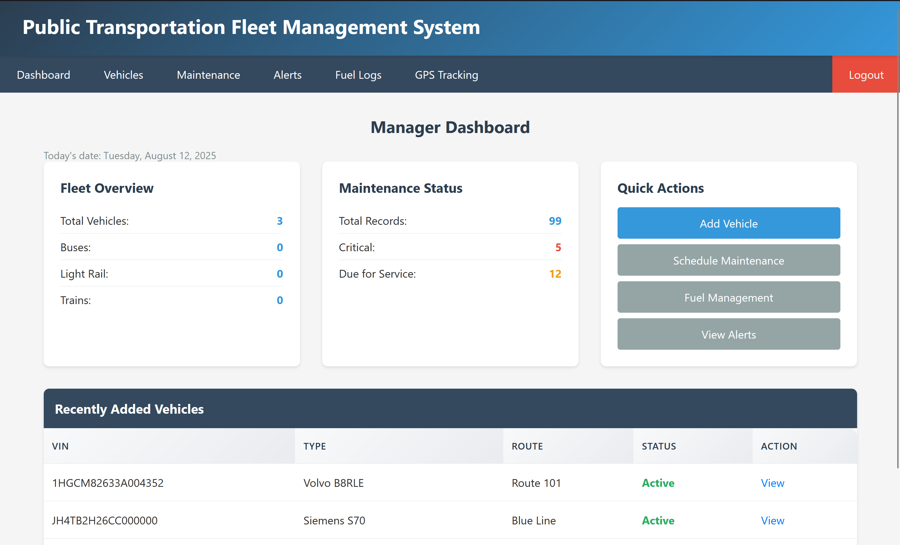
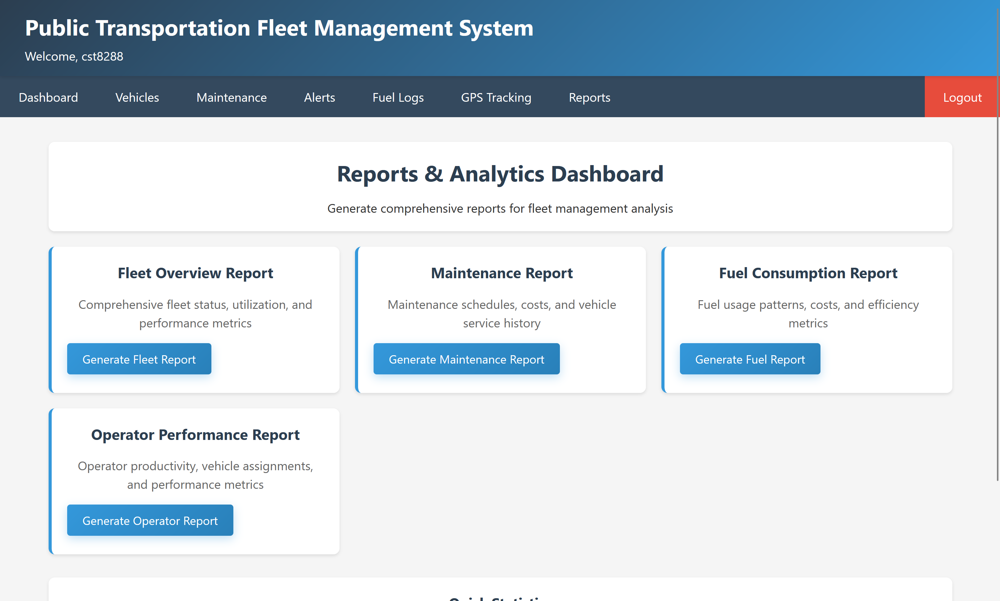
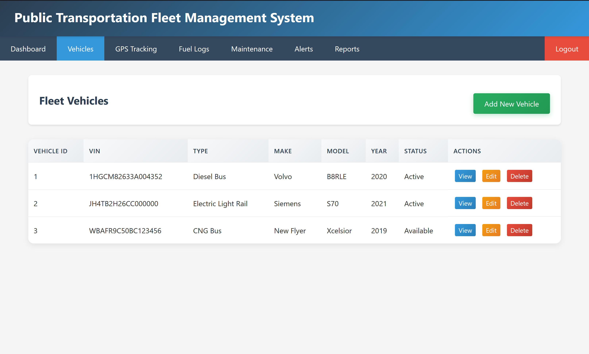

# Public Transit Fleet Management System (PTFMS)

  

## Overview
Public Transit Fleet Management System (PTFMS) is a Java / Jakarta EE application that helps transit agencies monitor, track, and optimize operations of buses, light rail, and train assets. It centralizes vehicle inventory, maintenance scheduling, fuel usage, GPS events, alerts, and analytics—exposed through role‑based dashboards.

## 🚀 Quick Deployment

**One-command deployment with Docker:**

### Windows
```powershell
.\deploy.ps1
```

### Linux/macOS
```bash
./deploy.sh
```

**Access the application at:** http://localhost:8080

**Test credentials:**
- Manager: `jmanager` / `password123`
- Operator: `soperator` / `password123`

📖 **Detailed deployment guide:** [DEPLOYMENT.md](DEPLOYMENT.md)

## Table of Contents
1. [Overview](#overview)
2. [Architecture](#architecture)
3. [Design Patterns Implemented](#design-patterns-implemented)
4. [Project Structure](#project-structure)
5. [Database Schema](#database-schema)
6. [Technology Stack](#technology-stack)
7. [Screenshots](#screenshots)
8. [Features](#features)
9. [Functional Requirements Implemented](#functional-requirements-implemented)
10. [Quick Start](#quick-start)
11. [Core Routes / Servlets](#core-routes--servlets)
12. [User Roles](#user-roles)
13. [Future Enhancements](#future-enhancements)
14. [License](#license)

> Docker support included: see Docker & Compose section below for running locally.

## Architecture
Logical 3‑tier structure:
- **Presentation Layer** – Jakarta Servlets that compose HTML responses + static assets in `src/main/webapp/assets` (no templating engine yet)
- **Business Layer** – Facade (`PTFMSController`), services, commands, and maintenance strategies encapsulating domain logic
- **Data Layer** – DAO classes with a pooled `DataSource` abstraction for MySQL

## Design Patterns Implemented

### Core Patterns
1. **DAO (Data Access Object)** – Isolates persistence logic (`*DAO` classes)
2. **Builder** – `VehicleBuilder` for fluent `VehicleDTO` construction
3. **Strategy** – Maintenance scheduling algorithms (`TimeBased`, `UsageBased`, `Predictive`)
4. **Command** – Encapsulated state-changing actions (add vehicle, add fuel log, schedule maintenance)
5. **Simple Factory** – `ServiceFactory` centralizes service instantiation
6. **Observer (Pluggable)** – Package reserved for future event/notification expansion
7. **Facade** – `PTFMSController` presents a simplified orchestration API

## Project Structure (Simplified)
```
src/main/java/
├── businesslayer/
│   ├── ServiceFactory.java
│   ├── VehicleBuilder.java
│   ├── commands/
│   ├── observers/
│   ├── services/                # AlertService, FuelLogService, ...
│   └── strategies/              # MaintenanceStrategy + 3 implementations
├── controllers/                 # PTFMSController (facade)
├── dataaccesslayer/             # *DAO classes + DataSource
├── servlets/                    # All HTTP endpoints (LoginServlet, ReportsServlet, ...)
├── transferobjects/             # DTOs (VehicleDTO, MaintenanceDTO, FuelLogDTO, ...)
├── utils/                       # Helpers (HeaderUtils)
└── V1__create_tables.sql        # Schema initializer

src/main/resources/
└── database.properties          # DB configuration

src/main/webapp/
├── index.html
├── assets/                      # CSS / static resources
└── WEB-INF/                     # Deployment descriptors (web.xml, beans.xml)
```

## Database Schema
The application uses MySQL 8.0.40 with the following tables:
- `users` - User authentication and roles
- `vehicles` - Vehicle information
- `maintenance` - Maintenance records
- `fuel_logs` - Fuel consumption tracking

## Technology Stack
- Java 21
- Jakarta EE 10 (Servlets)
- MySQL 8.0.40
- Apache Tomcat 9.0.90+
- Maven (build / dependency management)
- HTML/CSS (server-rendered views)

## Screenshots
| Manager Dashboard | Reports Dashboard | Vehicles List |
|-------------------|-------------------|---------------|
|  |  |  |

## Features
- User registration & authentication (BCrypt password hashing)
- Role‑based dashboards (Manager | Operator)
- Vehicle inventory management (create, view, edit, delete)
- Maintenance tracking with time/usage/predictive strategies
- Fuel log management & aggregate consumption metrics
- GPS event tracking (arrival / departure events; extensible for live feeds)
- Alert recording & retrieval framework
- Analytics reports (fleet, maintenance, fuel, operator performance)
- Modular services + DAOs with clear separation of concerns
- Extensible architecture prepared for real-time and API expansion

## Functional Requirements Implemented
- FR-01: User registration & authentication
- FR-02: Vehicle management (CRUD)
- FR-03: Maintenance tracking (time, usage, predictive)
- FR-04: Fuel log recording & aggregation
- FR-05: Reporting dashboards (fleet, maintenance, fuel, operator)
- FR-06: Role-based access control (manager/operator)
- Foundation: GPS event logging & future live tracking / alert escalation

## Quick Start
1. Clone repository
2. Configure database credentials in `src/main/resources/database.properties` (or equivalent path if relocated)
3. Create MySQL schema and run migration script `V1__create_tables.sql`
4. Build & package:
   ```bash
   mvn clean package
   ```
5. Deploy generated WAR from `target/` to Tomcat `webapps/`
6. Access: `http://localhost:8080/FinalProject-PTFMS`
7. Create an initial manager user via registration screen, then log in.

### Optional Development Run
If using an IDE with embedded Tomcat config, point deployment to the generated WAR or exploded directory.

## Core Routes / Servlets
| Path | Servlet | Purpose |
|------|---------|---------|
| `/login` | `LoginServlet` | Authenticate user |
| `/register` | `RegisterServlet` | Register new user |
| `/vehicles` | `VehicleServlet` | Vehicle CRUD operations |
| `/maintenance` | `MaintenanceServlet` | Maintenance listing & scheduling |
| `/fuel-logs` | Fuel-related servlet (if present) | Fuel log operations |
| `/gps-tracking` | `GPSTrackingServlet` | GPS event tracking & reports |
| `/reports` | `ReportsServlet` | Fleet & analytics reports |
| `/manager-dashboard` | `ManagerDashboardServlet` | Manager overview |
| `/operator-dashboard` | `OperatorDashboardServlet` | Operator overview |
| `/logout` | `LogoutServlet` | End user session |

## User Roles
- Manager – Full access: dashboards, reports, maintenance, operator metrics, administrative actions
- Operator – Operational scope: vehicles, maintenance visibility, fuel logs, GPS events

## Future Enhancements
- Templating layer (JSP/JSTL, Thymeleaf, or server-side rendering abstraction)
- REST/JSON API for SPA or mobile client integration
- Real-time GPS stream (WebSocket/SSE) + map visualization (Leaflet / OpenLayers)
- Alert severity & notification channels (email / SMS / push)
- Expanded test suite (JUnit + Mockito + integration tests)
- Caching layer (e.g., Caffeine) for heavy/aggregated report queries
- CI pipeline (GitHub Actions) with build, test, quality gates
- Security hardening (stronger password policies, CSRF protection, rate limiting)

## Build and Deployment
1. Ensure MySQL is running and schema created (apply `V1__create_tables.sql` once)
2. Update DB credentials in `src/main/resources/database.properties`
3. Build with Maven: `mvn clean package`
4. Deploy generated WAR (`target/FinalProject-PTFMS-1.0-SNAPSHOT.war`) to Tomcat
5. Access at: `http://localhost:8080/FinalProject-PTFMS`

## Prerequisites
- JDK 21 installed and `JAVA_HOME` set
- Maven 3.9+
- MySQL 8.x server running (user with create/read/write privileges)
- Apache Tomcat 9 (or compatible Jakarta EE Servlet container)

## Data Model Summary
Core tables: `users`, `vehicles`, `vehicle_components`, `maintenance`, `fuel_logs`, `gps_tracking`, `alerts`, `reports`.
- Relationships: `maintenance`, `fuel_logs`, `gps_tracking`, and `alerts` reference `vehicles` (and sometimes `users`).
- Predictive maintenance uses historical maintenance rows + vehicle attributes.

## Security Notes
- Passwords hashed with BCrypt (`jbcrypt`).
- Session-based auth via HttpSession; logout invalidates session.
- Future: add CSRF tokens & stricter password policy.

## Contributing (Lightweight Guidelines)
Small improvements (typos, docs, minor refactors) are welcome via PR. For larger changes, open an issue first with rationale + brief design. Include Javadoc for new public methods.

## License
MIT License © 2025 Louis Bertrand Ntwali. See [LICENSE](LICENSE) for full text.

## Docker & Compose
Quick local run (builds app + MySQL):
```bash
docker compose up -d --build
```
Then visit http://localhost:8080/

Default credentials are not auto-seeded; register a user through the UI.

Environment variables (override in compose or deployment):
- DB_HOST, DB_PORT, DB_NAME, DB_USER, DB_PASS

Rebuild after code changes:
```bash
docker compose build app && docker compose up -d
```

Tear down (keeps DB volume):
```bash
docker compose down
```
Remove volume too:
```bash
docker compose down -v
```
